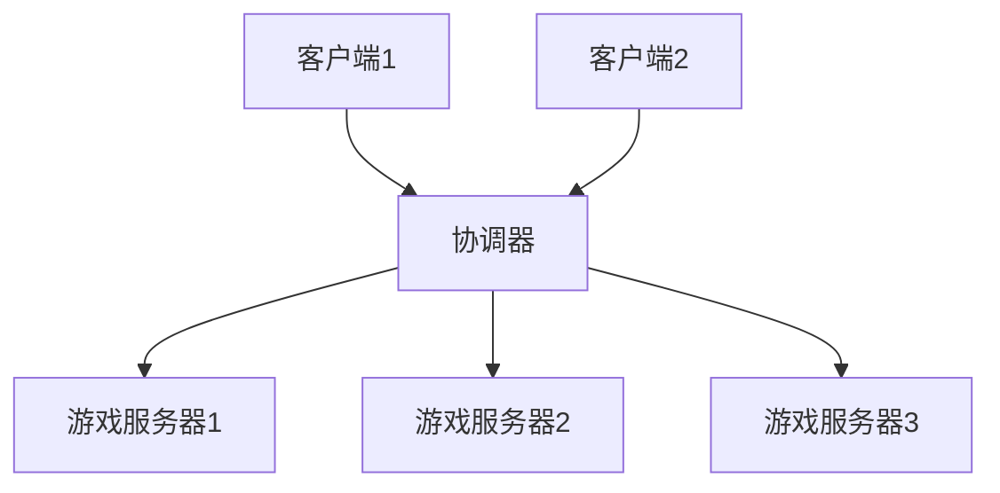

# 答辩图片准备清单

> 配合 PPT 使用的图片、截图、代码示例清单

---

## 目录

1. [必备图片（优先级⭐⭐⭐⭐⭐）](#必备图片)
2. [重要图片（优先级⭐⭐⭐⭐）](#重要图片)
3. [补充图片（优先级⭐⭐⭐）](#补充图片)
4. [截图技巧](#截图技巧)
5. [图片处理建议](#图片处理建议)

---

## 必备图片（优先级⭐⭐⭐⭐⭐）

### 1. 游戏运行截图

#### 1.1 游戏主界面
```
文件名：01_主界面.png
内容：
- 游戏启动后的主菜单
- 包含"创建游戏"、"加入游戏"按钮
- 显示项目名称和 Logo

拍摄要点：
✅ 界面清晰
✅ 分辨率 1920x1080
✅ 无遮挡
```

#### 1.2 角色选择界面
```
文件名：02_角色选择.png
内容：
- 显示可选角色（Crunch、Phase）
- 角色 3D 模型展示
- 角色技能图标

拍摄要点：
✅ 角色模型清晰
✅ 技能图标可见
✅ UI 布局完整
```

#### 1.3 游戏对战场景
```
文件名：03_游戏对战.png
内容：
- 5v5 对战场景
- 显示角色、小兵、技能特效
- UI 界面（血条、技能栏、小地图）

拍摄要点：
✅ 画面精彩（正在释放技能）
✅ 特效明显
✅ UI 完整
✅ 多个角色在场景中
```

#### 1.4 技能释放特效
```
文件名：04_技能特效.png
内容：
- 角色正在释放技能
- 技能特效清晰可见
- 显示技能名称或图标

拍摄要点：
✅ 特效华丽
✅ 动作清晰
✅ 光影效果好
```

#### 1.5 游戏胜利界面
```
文件名：05_胜利界面.png
内容：
- 游戏结束后的胜利/失败界面
- 显示战绩统计
- 显示玩家数据

拍摄要点：
✅ 界面完整
✅ 数据清晰
```

---

### 2. 架构图（必须有！）

#### 2.1 系统架构图
```
文件名：06_系统架构图.png
内容：
客户端 ↔ 协调器 ↔ 游戏服务器

制作方式：
- 使用 draw.io 或 ProcessOn
- 或者用 PPT 画图
- 或者用代码生成（Mermaid）

示例代码（Mermaid）：


拍摄要点：
✅ 清晰易懂
✅ 标注完整
✅ 颜色区分
```

#### 2.2 网络通信流程图
```
文件名：07_网络流程图.png
内容：
玩家创建房间 → 协调器启动服务器 → 玩家加入 → 开始游戏

制作方式：
- 流程图工具
- 或手绘后拍照

拍摄要点：
✅ 流程清晰
✅ 步骤完整
✅ 箭头明确
```

#### 2.3 技能系统架构图
```
文件名：08_技能系统架构.png
内容：
Ability System Component
├── Abilities（技能）
├── Attributes（属性）
└── Effects（效果）

制作方式：
- 树状图
- 或思维导图

拍摄要点：
✅ 层次清晰
✅ 关系明确
```

---

### 3. 代码截图

#### 3.1 技能系统代码
```
文件名：09_技能系统代码.png
文件位置：Source/Crunch/Public/GAS/CGameplayAbility.h

截图内容：
class UCGameplayAbility : public UGameplayAbility
{
    GENERATED_BODY()
public:
    UCGameplayAbility();
    virtual bool CanActivateAbility(...) const override;
protected:
    AActor* GetAimTarget(...) const;
    // ...
};

拍摄要点：
✅ 代码格式清晰
✅ 语法高亮
✅ 注释可见
✅ 不要截太多（20-30行即可）
```

#### 3.2 网络 RPC 代码
```
文件名：10_网络RPC代码.png
文件位置：Source/Crunch/Public/GAS/CGameplayAbility.h

截图内容：
// 服务器 RPC
UFUNCTION(Server, Reliable)
void Server_UseSkill(int32 SkillID);

// 客户端 RPC
UFUNCTION(Client, Reliable)
void Client_ShowDamage(int32 Damage);

// 多播 RPC
UFUNCTION(NetMulticast, Reliable)
void Multicast_PlayEffect(FVector Location);

拍摄要点：
✅ 显示 UFUNCTION 宏
✅ 显示 Server/Client/Multicast 关键字
✅ 注释清晰
```

#### 3.3 协调器代码
```
文件名：11_协调器代码.png
文件位置：Coordinator/coordinator.py

截图内容：
@app.route('/Sessions', methods=['POST'])
def CreateServer():
    sessionName = request.get_json().get('SESSION_NAME')
    sessionSearchId = request.get_json().get('SESSION_SEARCH_ID')
    
    port = CreateServerLocalTest(sessionName, sessionSearchId)
    return jsonify({"status": "success", "PORT": port})

拍摄要点：
✅ Python 语法高亮
✅ 显示 Flask 装饰器
✅ 代码简洁
```

---

### 4. UE 编辑器截图

#### 4.1 蓝图编辑器
```
文件名：12_蓝图编辑器.png
内容：
- 打开一个技能蓝图
- 显示节点连接
- 显示蓝图逻辑

拍摄要点：
✅ 节点清晰
✅ 连线可见
✅ 不要太复杂（选择简单的蓝图）
```

#### 4.2 材质编辑器
```
文件名：13_材质编辑器.png
内容：
- 打开一个角色材质
- 显示材质节点

拍摄要点：
✅ 节点清晰
✅ 预览窗口可见
```

#### 4.3 行为树编辑器
```
文件名：14_行为树编辑器.png
内容：
- 打开小兵的行为树
- 显示 AI 决策逻辑

拍摄要点：
✅ 树状结构清晰
✅ 节点名称可见
```

---

## 重要图片（优先级⭐⭐⭐⭐）

### 5. 项目文件结构

#### 5.1 项目目录结构
```
文件名：15_项目目录.png
内容：
- 在 VS Code 或文件管理器中
- 显示项目文件夹结构
- 展开主要文件夹

拍摄要点：
✅ 结构清晰
✅ 主要文件夹可见
✅ 不要展开太多层级
```

#### 5.2 代码统计
```
文件名：16_代码统计.png
内容：
- 使用工具统计代码行数
- 显示各语言占比

工具推荐：
- VS Code 插件：Code Counter
- 或在线工具：https://codetabs.com/count-loc/count-loc-online.html

拍摄要点：
✅ 数据清晰
✅ 图表美观
```

---

### 6. Docker 部署截图

#### 6.1 Docker 容器列表
```
文件名：17_Docker容器.png
命令：docker ps

内容：
CONTAINER ID   IMAGE              STATUS    PORTS
abc123         coordinator        Up        0.0.0.0:7777->7777/tcp
def456         crunch-server      Up        0.0.0.0:7778->7777/tcp

拍摄要点：
✅ 显示多个容器
✅ 端口映射清晰
✅ 状态为 Up
```

#### 6.2 Docker Compose 配置
```
文件名：18_DockerCompose配置.png
文件位置：ServerDeploy/docker-compose.yaml

截图内容：
services:
  coordinator:
    build: ./coordinator
    ports:
      - '7777:7777'
  server:
    build: ./server

拍摄要点：
✅ YAML 格式清晰
✅ 缩进正确
```

---

### 7. 测试和运行截图

#### 7.3 服务器日志
```
文件名：19_服务器日志.png
命令：docker logs coordinator

内容：
 * Running on http://0.0.0.0:7777
Request Create And Join Session: 测试房间
Session Created Successfully

拍摄要点：
✅ 日志清晰
✅ 显示关键信息
✅ 无错误信息
```

#### 7.4 网络请求测试
```
文件名：20_网络请求.png
工具：Postman 或 curl

内容：
POST http://localhost:7777/Sessions
{
  "SESSION_NAME": "测试房间",
  "SESSION_SEARCH_ID": "test-123"
}

Response:
{
  "status": "success",
  "PORT": 7778
}

拍摄要点：
✅ 请求和响应都可见
✅ JSON 格式化
```

---

## 补充图片（优先级⭐⭐⭐）

### 8. 开发工具截图

#### 8.1 Visual Studio
```
文件名：21_VisualStudio.png
内容：
- 打开项目解决方案
- 显示代码编辑器
- 显示解决方案资源管理器

拍摄要点：
✅ 界面专业
✅ 代码清晰
```

#### 8.2 Unreal Editor
```
文件名：22_UnrealEditor.png
内容：
- UE5 编辑器主界面
- 显示场景视图
- 显示内容浏览器

拍摄要点：
✅ 界面完整
✅ 场景美观
```

---

### 9. 性能监控

#### 9.1 性能统计
```
文件名：23_性能统计.png
内容：
- UE5 的 Stat FPS 命令
- 显示帧率、内存占用

命令：
在游戏中按 ~ 键，输入：stat fps

拍摄要点：
✅ FPS 稳定在 60+
✅ 数据清晰
```

#### 9.2 网络统计
```
文件名：24_网络统计.png
内容：
- UE5 的 Stat Net 命令
- 显示网络延迟、带宽

命令：
在游戏中按 ~ 键，输入：stat net

拍摄要点：
✅ 延迟低（<100ms）
✅ 数据清晰
```

---

### 10. 文档截图

#### 10.1 技术文档
```
文件名：25_技术文档.png
内容：
- 显示你写的技术文档
- 在 VS Code 或 Typora 中打开

拍摄要点：
✅ 文档排版美观
✅ 内容清晰
✅ 显示目录结构
```

#### 10.2 Git 提交记录
```
文件名：26_Git提交.png
内容：
- 显示 Git 提交历史
- 显示提交次数和时间线

工具：
- GitHub Desktop
- 或 Git 命令：git log --oneline --graph

拍摄要点：
✅ 提交记录丰富
✅ 提交信息规范
```

---

## 截图技巧

### 1. 截图工具推荐

**Windows：**
```
1. Snipaste（推荐）
   - 免费
   - 功能强大
   - 支持标注

2. Windows 自带截图
   - Win + Shift + S

3. QQ 截图
   - Ctrl + Alt + A
```

**Mac：**
```
1. Command + Shift + 4
2. Command + Shift + 3
```

### 2. 截图规范

```
分辨率：1920x1080 或更高
格式：PNG（清晰）
大小：每张 < 5MB
命名：按编号命名（01_xxx.png）
```

### 3. 截图要点

```
✅ 画面清晰，无模糊
✅ 无个人隐私信息
✅ 无无关窗口
✅ 光标不要在截图中
✅ 窗口最大化
✅ 关闭通知
```

### 4. 代码截图技巧

```
1. 使用 VS Code 截图
   - 安装插件：Polacode
   - 选中代码 → 右键 → Polacode

2. 使用在线工具
   - Carbon：https://carbon.now.sh
   - 支持多种主题
   - 自动语法高亮

3. 手动截图
   - 选择深色主题（更专业）
   - 字体大小：14-16pt
   - 不要截太多代码（20-30行）
```

---

## 图片处理建议

### 1. 图片压缩

```
工具：
- TinyPNG：https://tinypng.com
- 压缩率：50-70%
- 质量几乎无损

目的：
- 减小 PPT 文件大小
- 加快加载速度
```

### 2. 图片标注

```
工具：
- Snipaste
- 或 PPT 自带标注

标注内容：
- 重点区域用红框
- 关键信息用箭头
- 添加文字说明
```

### 3. 图片美化

```
调整：
- 亮度：稍微提高
- 对比度：稍微提高
- 裁剪：去掉无关部分

工具：
- Windows 照片应用
- 或在线工具：https://www.photopea.com
```

---

## 图片使用建议

### PPT 中的图片布局

```
第1页（封面）：
- 游戏主界面（背景）

第3页（项目概述）：
- 游戏对战场景

第5页（技术路线）：
- 系统架构图
- 网络流程图

第6页（已完成工作）：
- 项目目录结构
- 代码统计图

第7页（核心技术）：
- 技能系统代码
- 网络 RPC 代码
- 行为树编辑器

第8页（Docker 部署）：
- Docker 容器列表
- Docker Compose 配置

第11页（项目成果）：
- 角色选择界面
- 技能特效
- 胜利界面
```

---

## 快速准备清单

### 最少准备（10张）

```
必须有的 10 张图片：
1. ✅ 游戏主界面
2. ✅ 游戏对战场景
3. ✅ 技能特效
4. ✅ 系统架构图
5. ✅ 网络流程图
6. ✅ 技能系统代码
7. ✅ 网络 RPC 代码
8. ✅ 协调器代码
9. ✅ Docker 容器列表
10. ✅ 项目目录结构
```

### 推荐准备（20张）

```
在最少准备的基础上，增加：
11. ✅ 角色选择界面
12. ✅ 胜利界面
13. ✅ 蓝图编辑器
14. ✅ 行为树编辑器
15. ✅ 代码统计
16. ✅ Docker Compose 配置
17. ✅ 服务器日志
18. ✅ 网络请求测试
19. ✅ Visual Studio
20. ✅ 技术文档
```

### 完整准备（26张）

```
包含上述所有图片
```

---

## 时间安排

```
准备 10 张图片：约 1 小时
准备 20 张图片：约 2 小时
准备 26 张图片：约 3 小时

建议：
- 先准备必须的 10 张
- 再根据时间补充其他图片
```

---

## 注意事项

### ⚠️ 避免的错误

```
❌ 截图模糊
❌ 包含个人信息（邮箱、手机号）
❌ 包含错误信息
❌ 窗口太小
❌ 代码太多（看不清）
❌ 图片太大（PPT 卡顿）
```

### ✅ 最佳实践

```
✅ 截图清晰
✅ 窗口最大化
✅ 关闭无关程序
✅ 使用深色主题（代码）
✅ 适当标注
✅ 压缩图片
✅ 统一命名
```

---

## 总结

### 优先级排序

```
第一优先级（必须有）：
- 游戏运行截图（3张）
- 系统架构图（2张）
- 代码截图（3张）

第二优先级（推荐有）：
- UE 编辑器截图（3张）
- Docker 部署截图（2张）
- 项目文件结构（2张）

第三优先级（锦上添花）：
- 性能监控（2张）
- 开发工具（2张）
- 文档截图（2张）
```

### 快速行动计划

```
今天：
1. 截取游戏运行截图（5张）
2. 制作系统架构图（2张）
3. 截取代码截图（3张）

明天：
4. 截取 UE 编辑器截图（3张）
5. 截取 Docker 部署截图（2张）
6. 整理和压缩图片

后天：
7. 补充其他图片
8. 标注和美化
9. 插入到 PPT 中
```

---

**祝你准备顺利！** 📸
